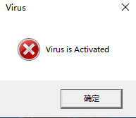
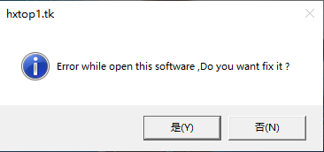
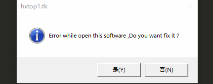

##如何利用vbs脚本编写无害的病毒

之前的教程都在介绍渗透测试的教程，今天我们就来讲一个比较轻松的内容

大家都见过病毒，但是你听过假病毒吗？

是的，就是假病毒，无害但是看起来很吓人

那问题就是如何编写假病毒呢？

##如何编写一个无害但是看起来却会让人相信的病毒呢？##
今天我们利用Windows自带的vbs脚本，很容易就可以实现

快来看看如何实现

根据上面我们很容易知道这个病毒是利用vbs编写的，那程序难不难呢？

我可以很肯定地告诉你，不难，而且我们只需要使用一条命令
你敢相信？

是的，就是只用一条命令就可以，其他的都是修改参数的值

那使用的是什么命令呢？

使用的是MsgBox

在开始编写程序之前，我们先来看一下这条命令的格式和参数


```
X=MsgBox("内容",0+16,"标题")
```

从这一条命令的用法中可以ihen情书的看到内容和标题的信息，那命令中的0和16分别是什么意思呢？


其中0的位置代表按钮的个数
其中16的位置代表显示信息的严重程度，就是警告还是危险之类的图标，继续往下看


###参数讲解

可以使用0，1，2，3，4，5代替命令中的0，其中0，1，2，3，4，5的含义为
```
0 = OK Button
1 = OK / Cancel Button
2 = Abort / Retry / Ignore Button
3 = Yes / No / Cancel Button
4 = Yes / No Button
5 = Retry / Cancel Button
```
可以使用16，32，48，64代替命令中的16，其中16，32，48，64的含义为
```
16 = Critical Icon
32 = Help Icon
48 = Warning Icon 
64 = Information Icon
```

知道这些参数的用法后，我们先来试试0+16的组合看看显示为什么样子

应该显示为**一个OK的按钮**和***严重***的图标显示




符合我们想的那样子
在看看一下4+64的组合是什么样子

应该显示为**一个YES按钮和一个No的按钮**再加上***提示信息***的图标显示




一样也符合要求

那接下来我们就来编写这个vbs脚本

```
X=MsgBox("Error while open this software ,Do you want fix it ?",4+64,"hxtop1.tk")

X=MsgBox("Unable to fix it ,Do you want scan your computer?",3+48,"Computer Scan")

X=MsgBox("Alert Virus has been detected,Do you want to delete this virus ?",3+16,"Alert")

X=MsgBox("Unable to delete this virus ",1+64,"Error")

X=MsgBox("Virus is Activated",2+16,"Virus")

X=MsgBox("Delete System Files",2+16,"File")

X=MsgBox("Virus is copying your password",2+48,"Password")

X=MsgBox("Uploading your file to server ,Do you want to stop it ?",4+64,"Uploading")

X=MsgBox("Can`t stop ,Now File transfer completed",1+16,"Transfer")

X=MsgBox("Your computer is Hached",1+64,"Hacked")
```
可以点击视频观看该脚本的效果




完成该脚本的编写之后，我们再将该脚本的图标进行修改，使其更加真实

有的电脑并不支持修改，如何可以支持更改的话，**右键-属性-更改图标，选择一个icon即可更改图标**

如果帮助到你了，希望可以得到你的打赏，谢谢[B站频道传送门](https://space.bilibili.com/184594996/ "Bilibili")